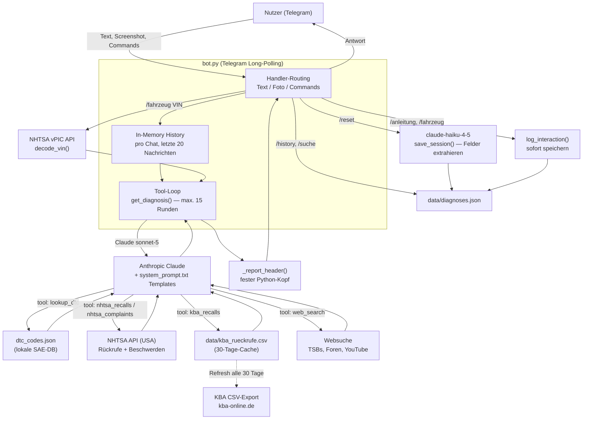

# Architecture

Technischer Überblick über Komponenten und Datenfluss. Bedienung/Setup siehe [HOW_TO_USE.txt](HOW_TO_USE.txt).

## Was der Bot macht

KFZ-Agent ist ein Telegram-Bot (`bot.py`) für Fahrzeug-/OBD-Diagnose. Ausgelöst wird er ausschließlich
durch eingehende Telegram-Nachrichten (Long-Polling, `app.run_polling`); es gibt keinen CLI- oder
Cron-Modus. Optional lässt sich der Bot per `ALLOWED_CHAT_ID` auf eine Chat-ID beschränken (Default:
offen für alle, falls nicht gesetzt).

**Eingaben:**
- **Text** — Hersteller/Modell/Baujahr + Fehlercode(s), z. B. „BMW 3er G20 2021, P0300, U0100".
- **Screenshot** eines OBD-Auslesegeräts oder einer Diagnose-Software — geht als Base64-Bild direkt an
  Claude Vision.
- **Commands**: `/start`, `/reset` (beendet die aktuelle Diagnosesession, speichert sie strukturiert in
  `data/diagnoses.json`), `/history` (letzte 5 gespeicherte Diagnosen), `/suche <Begriff>` (Volltextsuche
  über gespeicherte Diagnosen), `/anleitung [Fahrzeug/Code]` (Reparaturanleitung: YouTube-Videos per
  Websuche + eigene Schritt-für-Schritt-Anleitung), `/fahrzeug <VIN oder HSN/TSN>` (Fahrzeug-Info:
  technische Eckdaten, Stärken/Schwächen, Rückrufe, bekannte Probleme).

**Verarbeitung — Tool-Loop:** Jede Anfrage geht mit `system_prompt.txt` (KFZ-Diagnose-Experte, feste
Report-Templates pro Anfrageart) an `claude.messages.create` (`claude-sonnet-5`, bis zu 15 Tool-Runden).
Claude hat Zugriff auf fünf Tools:
- `lookup_dtc` — lokale SAE-Standard-DTC-Datenbank (`dtc_codes.json`, offline, keine API).
- `nhtsa_recalls` / `nhtsa_complaints` — NHTSA API (USA): Rückrufe bzw. Kundenbeschwerden je Fahrzeug.
- `kba_recalls` — KBA-Rückrufdatenbank (Deutschland/EU): CSV-Export von kba-online.de, lokal in
  `data/kba_rueckrufe.csv` gecacht und alle 30 Tage automatisch neu heruntergeladen.
- `web_search` — Claudes eingebautes Web-Search-Tool für TSBs, Foren (motor-talk.de, TDIClub, …),
  herstellerspezifische Codes, YouTube-Reparaturvideos.
- (indirekt über `/fahrzeug`) `decode_vin` — NHTSA vPIC API zur VIN-Dekodierung, wird direkt in Python
  aufgerufen (kein Claude-Tool) und das Ergebnis als Text in den Prompt eingebettet.

NHTSA und KBA werden für Rückrufe bewusst **beide** abgefragt: NHTSA deckt den US-Markt ab, KBA den
deutschen/EU-Markt — bei europäischen Fahrzeugen ist KBA meist aussagekräftiger, aber Motoren/Plattformen
werden oft konzernweit über mehrere Märkte verbaut, daher ergänzen sich beide Quellen.

Jede Antwort bekommt von Python einen festen Kopf vorangestellt (`_report_header`: Berichtstyp,
Fahrzeug, Datum) — das Format soll unabhängig vom Modell konsistent bleiben; Claude befüllt nur den
Inhalt nach den Templates aus `system_prompt.txt`.

**Speicherung:** Konversations-History liegt nur **in-memory** pro Chat (`_history: dict[chat_id, list]`,
auf die letzten 20 Nachrichten getrimmt) — geht bei Neustart verloren. Abgeschlossene Diagnosen (bei
`/reset`, per `claude-haiku-4-5` strukturiert aus dem Gespräch extrahiert) sowie einzelne `/anleitung`-
und `/fahrzeug`-Anfragen werden dauerhaft in `data/diagnoses.json` gespeichert (`database.py`).

## Datenfluss-Diagramm

## Deployment

Läuft **nicht auf einem Server** — es existiert kein systemd-Service und kein Cron-Job für kfz-agent
(auf dem Hetzner-Server, auf dem personal-agent läuft, wurde diese Session gezielt geprüft: kein
entsprechender Service vorhanden). Der Bot läuft aktuell nur lokal/manuell auf dem Windows-Rechner via
`py bot.py`, solange der Prozess läuft (Long-Polling). `BOT_TOKEN` und `ANTHROPIC_API_KEY` kommen aus
`config.ini` oder Umgebungsvariablen.
